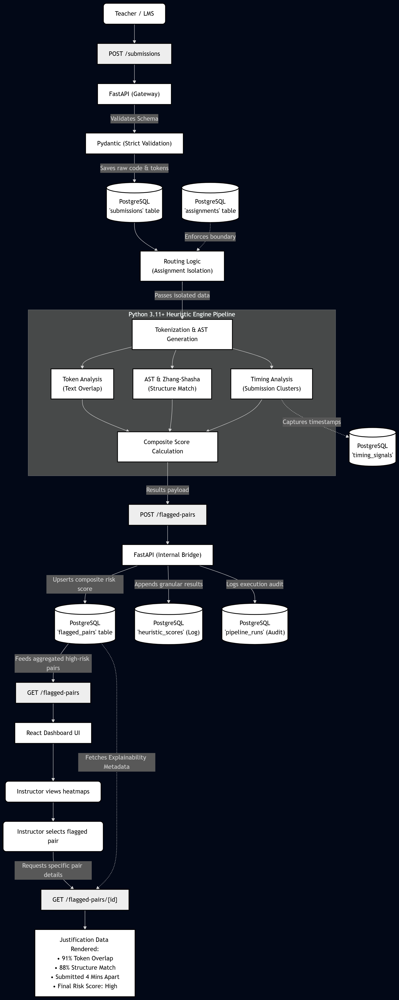

# 🔄 Plagiarism Signal Pipeline: Backend Workflow

Below is the tabular representation of the data flow and execution pipeline for the Plagiarism Signal Panel backend.

| Phase                | Component                      | Action Performed                                                                               | Data Layer / Storage                                                  |
| :---                 | :---                           | :---                                                                                           | :---                                                                  |
| **1. Ingestion**     | `app/api/routes.py`            | Receives raw code submissions from the LMS.                                                    | Validated strictly by Pydantic (`SubmissionCreate`).                  |
| **2. Normalization** | `app/heuristics/engine.py`     | Strips whitespaces, comments, and generates normalised token sequences.                        | Cached directly in the `submissions` DB table to avoid re-tokenising. |
| **3. Orchestration** | `app/heuristics/pipeline.py`   | Initiates an assignment-scoped run across all student pairs.                                   | Audit trail created in `pipeline_runs` table.                         |
| **4. Scoring**       | `app/heuristics/engine.py`     | Calculates structural heuristics (e.g., AST comparisons, Jaccard distance) and timing signals. | Append-only log saved to `heuristic_scores` table.                    |
| **5. Aggregation**   | `app/db/session.py`            | Computes the final composite risk score and updates the threat verdict.                        | Upserted to the `flagged_pairs` table for dashboard reading.          |
| **6. Visualization** | `frontend/` (React)            | Dashboard requests the similarity matrix and flagged pairs list.                               | Delivered seamlessly via `FlaggedPairResponse` API schemas.           |

---
*Note: All database interactions utilize SQLAlchemy ORM with PostgreSQL for maximum indexing efficiency during heuristic scoring.*

 

